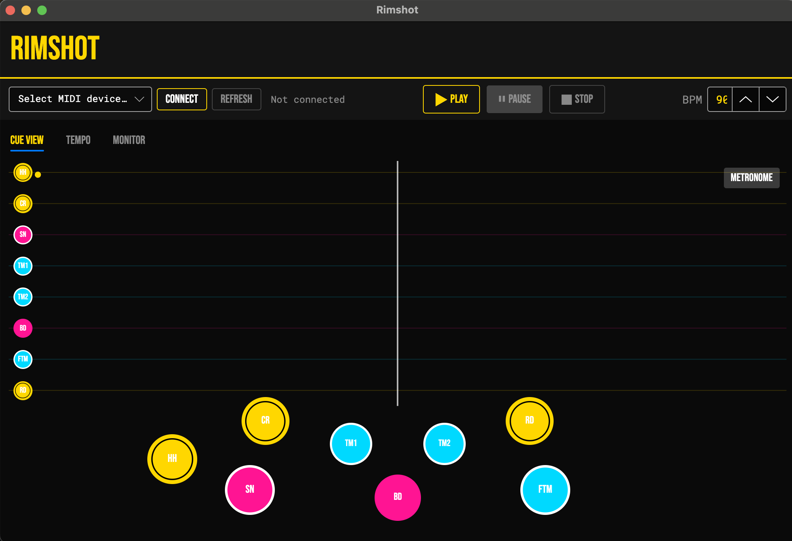

# 🥁 RIMSHOT

> *A drum trainer that hits harder than your snare.*


> ⚠️ **Early release (v0.x).** The core experience works, but expect rough edges and the occasional crash. Bug reports and feedback are very welcome — please open an [issue](https://github.com/pstricker/rimshot/issues).

---



---

## What Is This?

Rimshot is a drum trainer for your real electronic drum kit. Note cues scroll across the screen toward the hit zone — your job is to hit the right drum at the right time. Connect your MIDI kit, crank the BPM, and get tight.

No MIDI kit? No problem. Your keyboard works too.

---

## Features

### 🎯 Note Cues
Notes scroll from right to left and must be hit as they cross the white hit-zone line above the bass drum. You've got a **±150ms window** — tight but fair. Land it on the metronome beat and you'll get a sick lime green ring. Miss the beat and you get the lane color. Miss entirely and you get to think about what you've done.

### 🎼 Songs
Pick a built-in pattern from the **SONG** dropdown and the engine loops it forever:

- **Rock Beat** — your bread and butter
- **4-on-the-Floor** — kick on every quarter
- **Single Stroke Roll** — RLRLRLRL on the snare
- **Double Stroke Roll** — RRLLRRLL
- **Paradiddle** — RLRR LRLL, the rudiment that paid for your kit

Or pick **Load from file…** to drop in any `.mid` file. The lane strip auto-shrinks to show only the drums actually used by the current song — no point staring at a ride lane for a snare-only exercise.

Built-in patterns lead with a **one-bar silent intro** before the first note appears, so you have a beat to settle in instead of getting clobbered the instant you hit PLAY. Loaded `.mid` files start immediately — they have their own pacing.

### 🔁 Practice Loop
Above the cue view sits a mini timeline showing every note in the loaded song, laid out bar-by-bar. **Click and drag anywhere on it** to carve out a loop region — Rimshot will play just those bars on repeat until you nail them. Grab either edge to refine the range; the selection snaps to the 1/16 grid so your loop boundaries always land on a sensible beat.

A small **✕ CLEAR LOOP** button appears in the top-right of the timeline strip whenever a loop is active — click it to drop the selection and play the whole song again. Auto Play and the backing track both respect the loop bounds, so you can woodshed a single fill without the rest of the song getting in the way.

### 🤖 Auto Play
Flip the **AUTO PLAY** checkbox and Rimshot plays the song for you — perfect cues, perfect timing, perfect ego death. Great for hearing what a pattern *should* sound like before you embarrass yourself trying it.

### 🎹 Backing Track
Loaded a `.mid` file with melody, bass, or anything else that isn't drums? Check the **BACKING TRACK** box and Rimshot synthesizes the rest of the music alongside your drum cues — so you can play *along* with the song instead of in silence. Velocities, program changes, volume, pan, sustain pedal, and pitch bend are all preserved.

The checkbox appears whenever the loaded MIDI has non-drum channels. Backing track requires a General MIDI SoundFont (`.sf2`) — Rimshot doesn't ship with one. The first time you tick the box without a soundfont installed, Rimshot pops up a file picker; point it at any `.sf2` and Rimshot copies it into the right place and starts playing. Cancel the picker and the checkbox quietly unticks itself.

**FluidR3 GM** (MIT-licensed, ~25 MB trimmed / ~141 MB full) is the recommended soundfont. Mirrors:

- https://github.com/FluidSynth/fluidsynth/wiki/SoundFont
- https://musical-artifacts.com/artifacts/738
- https://archive.org/details/fluidr3-gm-gs

Prefer to install it by hand? Drop the `.sf2` into the `Sounds/soundfonts/` folder next to the Rimshot executable:

| Build | Path |
|-------|------|
| Windows installer | `%LOCALAPPDATA%\Programs\Rimshot\Sounds\soundfonts\` |
| Linux tarball | `<extract-dir>/Rimshot/Sounds/soundfonts/` |
| From source | `Rimshot/Sounds/soundfonts/` |

No soundfont, no problem: drum practice works the same either way.

### 🥁 8-Lane Drum Kit

| Lane | Piece | MIDI Notes | Color |
|------|-------|-----------|-------|
| HH | Hi-Hat | 42, 44, 46 | Gold |
| CR | Crash | 49 | Gold |
| SN | Snare | 38, 37 | Hot Pink |
| TM1 | Tom 1 | 50, 48 | Cyan |
| TM2 | Tom 2 | 47 | Cyan |
| BD | Bass Drum | 36 | Hot Pink |
| FTM | Floor Tom | 41, 43 | Cyan |
| RD | Ride | 51 | Gold |

Open hi-hat (note 46) is tracked separately — the HH indicator switches between `●` (closed) and `○` (open) in real time.

### 🎛 MIDI Hardware Support
Plug in any USB MIDI drum kit, click **CONNECT DRUMS** in the header, pick it from the dialog, hit CONNECT. The button is then replaced with a green badge showing the device name; click the **✎** next to it to swap to a different kit later. Velocity is captured live and maps directly to audio gain — hit harder, sound louder.

### ⌨️ Keyboard Mode
No kit? No excuses.

| Key | Drum |
|-----|------|
| `A` | Hi-Hat |
| `S` | Crash |
| `D` | Snare |
| `F` | Tom 1 |
| `G` | Tom 2 |
| `Space` | Bass Drum |
| `J` | Floor Tom |
| `K` | Ride |

Key repeat is suppressed — you have to actually re-press each key, just like a real drum hit.

### ⏱ BPM Control
Dial in anything from **40 to 200 BPM**. Change it live while playing — the engine re-syncs instantly without note pile-ups. Increment by 5 or type in whatever tempo you want to embarrass yourself at.

### 🎵 Metronome
Toggle the metronome on/off in the Cue View. Set your subdivision in the Tempo tab:

| Subdivision | Feel |
|------------|------|
| 1/1 | Whole notes — very zen |
| 1/2 | Half notes |
| 1/4 | Quarter notes — the classic |
| 1/8 | Eighth notes — get ready |

On-beat hits glow **lime green**. The metronome doesn't lie.

### 💥 Hit Feedback
Every hit spawns an expanding ring animation centered on the drum pad:
- **Lime green** ring = on-beat hit. Nice.
- **Lane-colored** ring = hit landed, but the metronome disagrees with you.

Rings expand to 2.4× the pad diameter and fade over 350ms.

### 📡 Monitor Tab
Every drum hit gets logged with a timestamp and velocity:
```
[14:23:01.042]  Snare               vel: 98
[14:23:01.458]  Bass Drum 1         vel: 112
[14:23:01.921]  Closed Hi-Hat       vel: 74
```
Keeps the last 200 hits. Hit **CLEAR** to start fresh.

### 🎚 Tempo Tab
A dedicated panel for BPM and metronome subdivision — synced with the main toolbar controls. Useful when you want to make adjustments without digging around the toolbar.

### 🔊 Audio Engine
Rimshot loads WAV samples from the `Sounds/` folder via OpenAL. Each lane gets a pool of 4 audio sources for polyphonic playback. If a WAV file is missing, it falls back to a **procedural synthesizer** — so the app always makes noise, even with no sample files.

Special routing:
- Hi-hat note 46 → `hh_open.wav` (open hat sound)
- Snare note 37 → `sn_rimshot.wav` (rimshot sound)

### 🎸 Startup Rimshot
Every time the app opens, it plays `rimshot.wav`. Because of course it does.

### ℹ️ About
**ABOUT** in the header opens a dialog with the current version, a link to the GitHub repo, a one-click bug-report shortcut, and the MIT license.

---

## 🔍 Rimshot Inspector

A separate companion app for staring at MIDI files before you load them. Drag a `.mid` onto the drop zone (or hit BROWSE) and Inspector tells you:

- **Tempo** — primary BPM, plus every tempo change with timestamps
- **Time signature** — including mid-song changes
- **Channel breakdown** — which channels carry notes, and which look like a GM drum channel
- **GM drum instruments** — every drum note name with hit count
- **Rimshot kit coverage** — which of the 8 lanes the file actually uses, plus a list of any drum notes that *don't* map to a Rimshot lane (so you know what'll be silent if you load it in the main app)

Useful for sanity-checking a MIDI before wondering why nothing's scrolling.

---

## Download

Pre-built packages for the [latest release](https://github.com/pstricker/rimshot/releases/latest):

| Platform | Download |
|----------|----------|
| Windows (x64) | [Rimshot-windows-x64.exe](https://github.com/pstricker/rimshot/releases/latest/download/Rimshot-windows-x64.exe) — installer |
| Linux (x64) | [Rimshot-linux-x64.tar.gz](https://github.com/pstricker/rimshot/releases/latest/download/Rimshot-linux-x64.tar.gz) |

> **macOS users:** signed binaries are coming once Apple Developer notarization is wired up. Until then, see [docs/MACOS-SETUP.md](docs/MACOS-SETUP.md) for a step-by-step guide to running Rimshot from source — works fine on Apple Silicon and Intel Macs.

Each package is self-contained — no .NET runtime install required. The Rimshot Inspector ships in the same package as a sub-folder.

### First-launch warnings

These builds aren't code-signed, so the OS will complain the first time you run them. The app is fine — proper code signing is on the roadmap.

**Windows:** double-click `Rimshot-windows-x64.exe`. SmartScreen will say *"Windows protected your PC"* — click **More info** → **Run anyway**. The installer creates a Start Menu shortcut and registers an uninstaller in Add/Remove Programs.

**Linux:** extract the tarball and run `./Rimshot/Rimshot`. No signing warnings; `chmod +x` if needed.

---

## Getting Started

> Building from source. If you just want to use Rimshot, grab a [download](#download) above.

### Prerequisites
- [.NET 8 SDK](https://dotnet.microsoft.com/download/dotnet/8)
- A USB MIDI drum kit *(optional — keyboard works fine)*
- Windows, Linux, or macOS. macOS works fine from source on Apple Silicon and Intel — see the dedicated [macOS setup guide](docs/MACOS-SETUP.md). Signed Mac binaries are pending Apple Developer notarization.

### Run It
```bash
git clone https://github.com/pstricker/rimshot.git
cd rimshot
dotnet run --project Rimshot/Rimshot.csproj
```

To launch the Inspector instead:
```bash
dotnet run --project Rimshot.Inspector/Rimshot.Inspector.csproj
```

### Connect Your Kit
1. Plug in your MIDI drum kit
2. Click **CONNECT DRUMS** in the header bar
3. Pick your kit from the dialog and hit CONNECT
4. Pick a song from the **SONG** dropdown
5. Hit **▶ PLAY** — use **⏸ PAUSE** to hold, **■ STOP** to reset back to bar 1, or **↺ RESTART** to jump to the song's start without leaving Running state
6. Start drumming

---

## Project Structure

The solution has three projects:

```
Rimshot.sln
├── Rimshot/                          — main app (the trainer)
│   ├── Services/
│   │   ├── AudioService.cs           — OpenAL playback, WAV loading
│   │   ├── CueEngine.cs              — song playback and cue scheduling
│   │   ├── DrumSynth.cs              — procedural audio fallback
│   │   ├── MetronomeService.cs       — beat tracking and subdivision
│   │   ├── MidiService.cs            — MIDI device I/O (DryWetMidi)
│   │   ├── MusicService.cs           — backing-track synthesizer (MeltySynth)
│   │   ├── SongLibrary.cs            — built-in pattern catalog
│   │   └── WavLoader.cs              — 16/24-bit PCM WAV parser
│   ├── Views/
│   │   ├── CueView                   — main 60fps canvas (notes, pads, rings)
│   │   ├── SongTimelineView          — bar-by-bar strip, drag-to-loop region
│   │   ├── TempoView                 — BPM + metronome subdivision UI
│   │   ├── ConnectDrumsDialog        — MIDI device picker (modal)
│   │   ├── SoundFontPromptWindow     — first-run .sf2 setup prompt
│   │   └── AboutWindow               — version + repo / bug-report / license dialog
│   ├── MainWindow                    — toolbar, song picker, tabs, transport
│   └── Sounds/                       — WAV samples (hh, sn, bd, cr, rd, toms...)
│       └── soundfonts/               — drop a .sf2 here to enable BACKING TRACK
│
├── Rimshot.Core/                     — shared library (used by both apps)
│   ├── Models/
│   │   ├── DrumLane.cs               — lane definitions, MIDI notes, colors
│   │   ├── DrumHit.cs                — hit event record
│   │   ├── FallingCue.cs             — scheduled note cue
│   │   ├── MelodicTrack.cs           — non-drum notes + program/CC/pitch-bend events
│   │   ├── PatternNote.cs            — note within a song
│   │   └── Song.cs                   — song record (notes + length + loop flag)
│   ├── Services/
│   │   ├── LoopSelectionService.cs   — practice-loop range, snapped to 1/16 grid
│   │   ├── MidiAnalysis.cs           — MIDI file inspection (used by Inspector)
│   │   └── SongLoader.cs             — .mid → Song conversion
│   ├── DrumMap.cs                    — GM drum note name lookup
│   └── Assets/
│       ├── Fonts/                    — Bebas Neue, Roboto Mono
│       ├── AppStyles.axaml           — global styles and color palette
│       └── icon.png
│
└── Rimshot.Inspector/                — companion app for analyzing .mid files
    └── MainWindow                    — drag-drop, kit coverage, tempo readout
```

---

## Tech Stack

| | |
|-|-|
| Language | C# 12 |
| Runtime | .NET 8 |
| UI Framework | Avalonia 12 |
| MIDI | Melanchall.DryWetMidi |
| Audio | Silk.NET.OpenAL |
| SoundFont synth | MeltySynth |
| Fonts | Bebas Neue, Roboto Mono |

---

*Built for drummers who want to get better, not just louder.*
